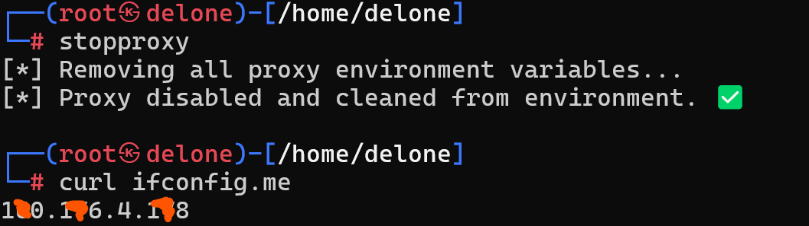

# **Tor Proxy Manager by Delone**

A simple shell script to manage Tor proxy settings on your system. This tool provides convenient functions to easily enable and disable the Tor proxy for your terminal sessions.

---

## **Features**

- **`startproxy`**: Enables Tor proxy by setting the appropriate proxy environment variables.
- **`stopproxy`**: Disables all proxy settings and cleans up the environment variables.
- **Automatic Proxy Activation**: Automatically enables the Tor proxy when a new terminal session is opened.
- **Environment Cleanup**: Ensures that all proxy settings are properly removed when disabled.

---

## **Requirements**

- **Tor** must be installed and running on your system.

### **Install Tor**:

For **Debian/Ubuntu** systems:

```bash
sudo apt update
sudo apt install tor
```

Start the Tor service:

```bash
sudo systemctl start tor
sudo systemctl enable tor
```

---

## **Setup Instructions**

### 1. **Add Functions to `.bashrc`**

To make use of the `startproxy` and `stopproxy` functions, follow these steps:

1. Open your `~/.bashrc`:

   ```bash
   nano ~/.bashrc
   ```

2. Add the following code at the end of the file:

   ```bash
   # --- Begin Tor Proxy configuration ---
   
   startproxy() {
       echo "[*] Enabling Tor proxy..."
       export TOR_PROXY="socks5h://127.0.0.1:9050"
       export http_proxy="$TOR_PROXY"
       export https_proxy="$TOR_PROXY"
       export ftp_proxy="$TOR_PROXY"
       export all_proxy="$TOR_PROXY"
       export no_proxy="localhost,127.0.0.1"
       echo "[*] Proxy enabled via Tor (127.0.0.1:9050). ✅"
   }
   
   stopproxy() {
       echo "[*] Removing all proxy environment variables..."
       while read -r var; do
           unset "$var"
       done < <(env | grep -i proxy | cut -d= -f1)
   
       # Optionally clean /etc/environment if needed
       if grep -qi proxy /etc/environment; then
           echo "[*] Cleaning /etc/environment..."
           sed -i.bak '/proxy/i # removed by stopproxy' /etc/environment
           sed -i '/proxy/d' /etc/environment
       fi
   
       unset http_proxy https_proxy ftp_proxy all_proxy no_proxy TOR_PROXY
   
       echo "[*] Proxy disabled and cleaned from environment. ✅"
   }
   
   # Auto-enable Tor proxy if not already enabled
   if [ -z "$http_proxy" ] && [ -z "$https_proxy" ]; then
       startproxy
   fi
   
   # --- End Tor Proxy configuration ---
   ```

3. Save the file (`Ctrl+O`, `Enter`) and exit (`Ctrl+X`).

4. Reload the `.bashrc` to apply the changes:

   ```bash
   source ~/.bashrc
   ```

---

## **Usage**

### 1. **Start the Proxy**

To activate the Tor proxy for your current terminal session, simply run:

```bash
startproxy
```

### 2. **Stop the Proxy**

To disable the proxy and remove the environment variables, run:

```bash
stopproxy
```

### 3. **Automatic Proxy Activation**

Each time you open a new terminal, the `startproxy` function will automatically activate Tor if it isn't already enabled.

---

## **Troubleshooting**

- **Tor Not Starting**: If Tor isn't working, ensure the service is running with:

  ```bash
  sudo systemctl start tor
  ```

- **Proxy Not Working**: Check the environment variables with:

  ```bash
  echo $http_proxy
  echo $https_proxy
  ```

  They should display `socks5h://127.0.0.1:9050` if the proxy is correctly enabled.

---

## **Contributing**

Feel free to submit issues or pull requests. Contributions are always welcome!


---

## **Contact**

For any questions or support, you can reach the author via Telegram:

[**t.me/nouredine_kn**](https://t.me/nouredine_kn)

